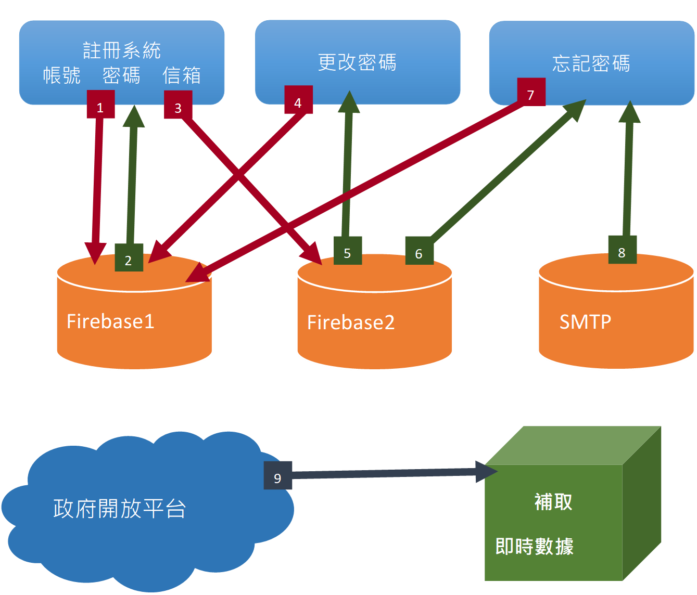

<h1> 智慧生活產品應用 課程期末報告</h1>

- 班級：商一A
- 期末報告題目：台灣空氣品質監測系統
- 組員： 11033151 徐逢謙
- 貢獻度：（11033151 徐逢謙）100%
- 程式資料流程圖：（下頁敘述介紹）
 
    1.	 存入帳號、密碼
    2.	 註冊成功或註冊失敗（帳號已有註冊）
    3.	 存入　信箱、帳號
    4.	 將更改密碼放回原資料庫
    5.	 獲取原先使用者密碼
    6.	 獲取信箱資訊
    7.	 將更改密碼放回原資料庫
    8.	 將信箱透過SMTP寄送OTP驗證信　
    9.	 將政府雲端平台資料（.CSV）即時的轉回數據庫中，並將其顯示出來
- 程式功用
  
台灣近幾年空氣品質一直是常見的話題，但每次都需要去查相對應資料，所以透過政府開放平台，將即時數據顯示出來，讓使用者可以立即的查看各場所的的空氣品質的現況。
- 程式說明：
  
使用者可以在登入介面選擇帳號登入或遊客登入，如果要註冊帳號就可按註冊按鈕前往註冊頁面，且註冊後會將資料傳送至firebase，之後即可用帳號登入系統，登入後等待讀取後，可從選單中選擇想看的縣市測站，查看資料，且在右上選單中，可選擇更改密碼，若忘記密碼也可在登入介面中輸入原本的信箱，即會將驗證碼傳送至該信箱後，即可更換新密碼。

-	（註冊帳號時需填寫gmail帳號且不需填@gmail.com  但忘記密碼時需全填寫）
-	 程式操作影片連結：
https://www.youtube.com/watch?v=MTLUURhkKLc
