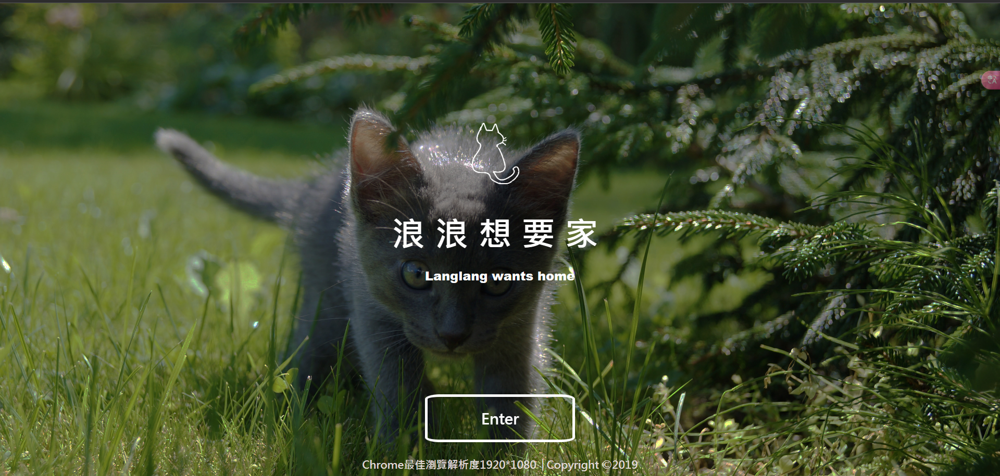
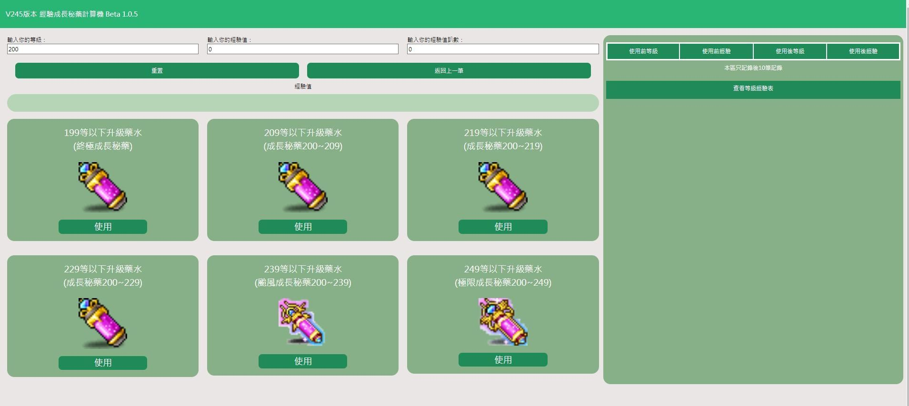
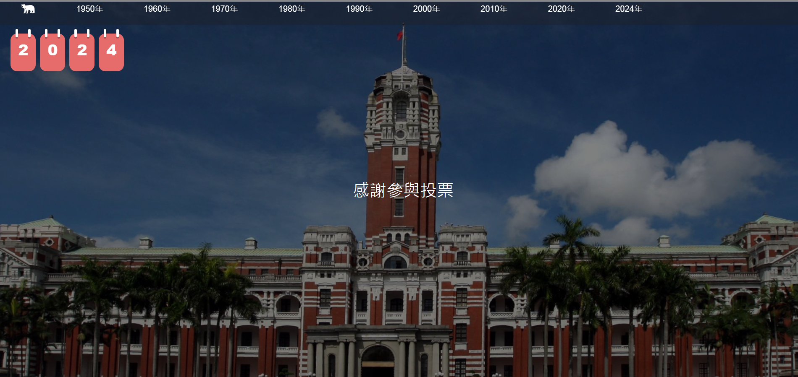
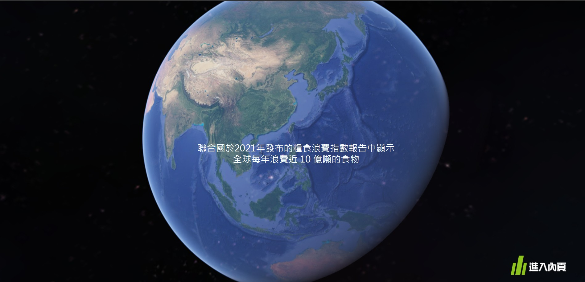
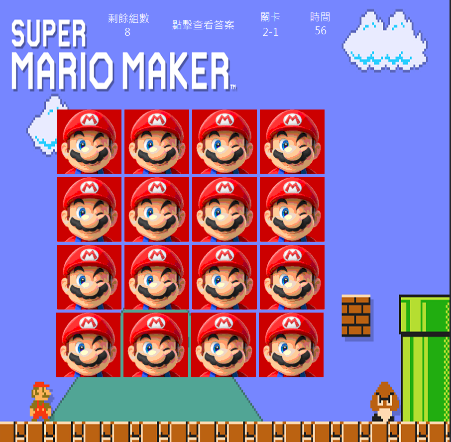
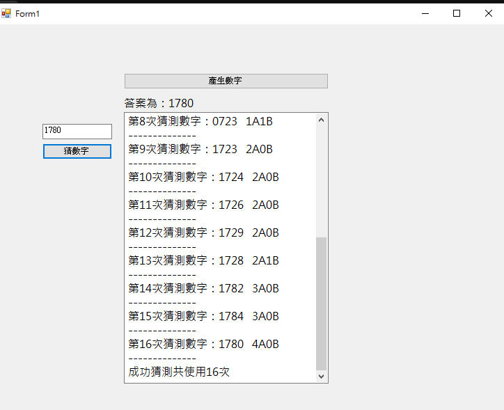
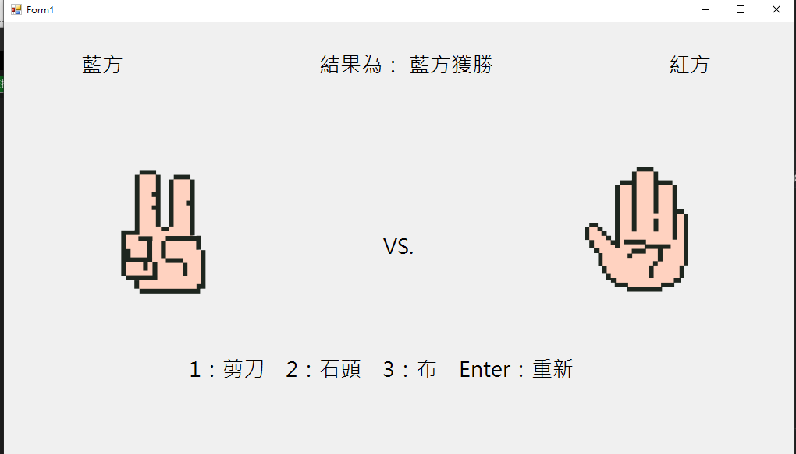
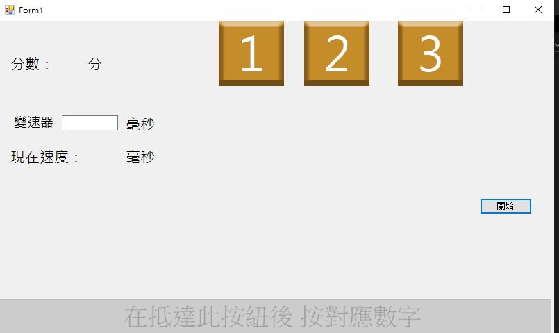
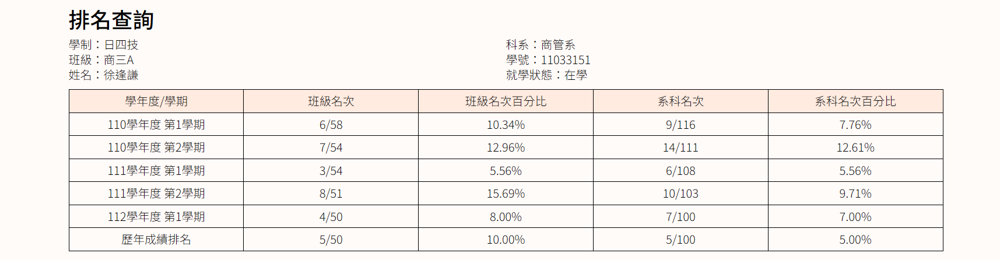
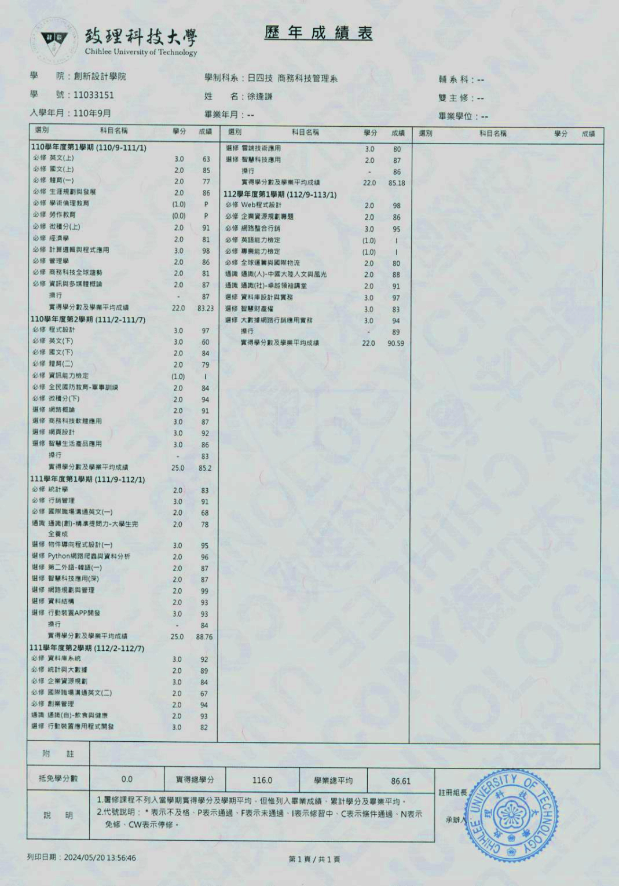

 <h1 > 關於我</h1>
 <h4 align=center > </h4>

- 姓名：徐逢謙 (Jack)
- 生日 : 09/14/2002
- 教育程度 :
  - 本系：致理科技大學-商務科技管理系(資訊模組) 預計於113年修業完畢
  - 輔系：致理科技大學-資訊管理系              預計於113年修業完畢
- 居住 : 新北市
- 信箱 : fengqian0914@gmail.com
- 履歷：<a href="https://drive.google.com/drive/folders/1kaPb8smEbPoCDdZt5VkV7gpw7_ykDDu9?usp=drive_link">雲端</a>
<h2 > 目錄 </h2>

- [自傳](https://github.com/fengqian0914/fengqian.github.io#Autobiography)
- [學歷](https://github.com/fengqian0914/fengqian.github.io#Educational_qualifications)
- [專業技能](https://github.com/fengqian0914/fengqian.github.io#Professional_skills)
  - [程式開發](https://github.com/fengqian0914/fengqian.github.io#Program_Development)
  - [辦公室軟體](https://github.com/fengqian0914/fengqian.github.io#Office_software)
  - [圖形設計和影像處理](https://github.com/fengqian0914/fengqian.github.io#Graphic_design_and_imageprocessing)
  - [其他](https://github.com/fengqian0914/fengqian.github.io#Other)
- [競賽紀錄/獎狀](https://github.com/fengqian0914/fengqian.github.io#Competition_records/Certificates)
  - [競賽記錄](https://github.com/fengqian0914/fengqian.github.io#Contest_Record)
  - [獎狀](https://github.com/fengqian0914/fengqian.github.io#Certificates)
- [作品集](https://github.com/fengqian0914/fengqian.github.io#Portfolio)
- [證書](https://github.com/fengqian0914/fengqian.github.io#certificate)
- [在校成績單](https://github.com/fengqian0914/fengqian.github.io#School_transcript)
<!-- - [興趣](https://github.com/fengqian0914/fengqian.github.io#Interest)  -->

<h2 id="Autobiography">  自傳 </h2>
<h3>自傳</h3>

我是徐逢謙，目前就讀於致理科技大學商務科技管理系（資訊模組）。除了本系的商業能力以及資訊能力課程外，為了加強資訊方面的能力，我**輔系資訊管理系**，這使我更全面地了解資訊科技領域，並且歷年成績系排多在前10%。除了學術上的傑出表現，我還注重自我提升，善於自主學習，積極尋求新知識和技能，在面對困難和挑戰時，有問題解決能力，來保持高效率和準確性。並以積極進取的態度對待生活和工作，相信每一次努力都會有所收穫。

<h3>專業經歷</h3>

我擅長網頁設計，目前在社群平台上發布協助玩家計算工具網站，目前已有超過**2萬多人**使用過，並且持續提供維護和更新。

除了學術上的成就外，在大學期間，我積極參與了各種學術和實踐項目，包括參加由叡揚資訊舉辦的GSS AI Chatbot Hackathon校園組，並且榮獲 **亞軍** 。這次比賽要求參賽者設計和開發LINE聊天機器人，這為我提供了實際的機器學習和自然語言處理方面的經驗，並加深了我對於人工智慧在實際應用中的理解。

<h3>未來展望</h3>

我對資訊科技行業充滿熱情，希望能在這個領域中不斷學習和成長。我期待著能夠與優秀的團隊合作，共同開發創新的產品和解決方案，為社會帶來價值和影響

<h2 id="Educational_qualifications">學歷</h2>

  - 致理科技大學
    - 本系：商務科技管理系(資訊模組) 預計於113年修業完畢
    - 輔系：致理科技大學-資訊管理系  預計於113年修業完畢
  - 新北市立新北高級工業職業學校
    - 資料處理科 

<h2 id="Professional_skills"> 專業技能</h2>

<h4 id="Program_Development" align="center"> 程式開發</h4>

--- 
  - HTML、CSS、JS  &nbsp;&nbsp;&nbsp;&nbsp;&nbsp; 

    - 使用具意義的方式來構建HTML。
    - 熟悉RWD以及Bootstrap3、4。
  - C# &nbsp;&nbsp;&nbsp;&nbsp;&nbsp; 
     - 能應用C#語言進行程式開發。
     - 能夠設計並實現中等複雜度的應用程式。
  - Microsoft SQL Server &nbsp;&nbsp;&nbsp;&nbsp;&nbsp; 
    - 熟悉Microsoft SQL Server資料庫管理系統。
    - 能夠設計和優化複雜的SQL查詢。
    - 具有基本的資料庫設計和管理能力。
  - PHP &nbsp;&nbsp;&nbsp;&nbsp;&nbsp; 
    - 能應用PHP進行網頁開發。
    - 能夠中等規模開發的Web應用程式。
  - Android Kotlin &nbsp;&nbsp;&nbsp;&nbsp;&nbsp; 
    - 能應用Koltin開發APP能力。
    - 能夠使用多種技術串連至API。
    - 了解Android應用程式的基本結構和開發流程
  - Python &nbsp;&nbsp;&nbsp;&nbsp;&nbsp; 
    - 具備基本的Python編程能力。
    - 了解Python的基本語法和應用場景。

      
<h4 id="Office_software" align="center"> 辦公室軟體</h4>

---  
  - Microsoft Word &nbsp;&nbsp;&nbsp;&nbsp;&nbsp; 
    - 熟練使用Microsoft Word進行文件編輯和排版。
    - 能夠製作專業水準的文件和報告。
    - 熟悉Word的高級功能，如郵件合併、格式設置等。
  - Microsoft PowerPoint &nbsp;&nbsp;&nbsp;&nbsp;&nbsp; 
    - 具有豐富的Microsoft PowerPoint使用經驗。
    - 能夠設計和製作具有吸引力和效果的演示文稿。
    - 熟悉PowerPoint的動畫和轉場效果，能夠增強演示效果。
  - Microsoft Excel &nbsp;&nbsp;&nbsp;&nbsp;&nbsp; 
    - 熟練應用Microsoft Excel進行數據分析和處理。
    - 能夠設計和管理複雜的Excel工作表和公式。
    - 具有Excel的數據可視化和報告製作能力。
<h4 id="Graphic_design_and_imageprocessing" align="center" > 圖形設計和影像處理</h4>

--- 
  - Adobe Photoshop &nbsp;&nbsp;&nbsp;&nbsp;&nbsp; 
    - 能夠進行影像編修和修飾，如調整色彩、修復照片等。
    - 具備基礎的平面設計能力，能夠製作簡單的圖片和視覺素材。
  - Adobe Illustrator &nbsp;&nbsp;&nbsp;&nbsp;&nbsp; 
    - 能夠進行商業識別設計，如製作標誌、圖標等。
    - 具備基礎的向量圖形設計能力，能夠創建簡單的圖形和插圖。
          
<h4 id="Other" align="center">其他</h4>

--- 
  - 企業資源規劃(ERP) 鼎新系統 &nbsp;&nbsp;&nbsp;&nbsp;&nbsp; 
    - 具備初階的企業資源規劃系統鼎新系統使用經驗。
    - 能夠進行基本的系統操作和功能設置。
    - 具備基礎的鼎新系統使用能力，能夠進行簡單的數據查詢和報表生成。
  - Qilk &nbsp;&nbsp;&nbsp;&nbsp;&nbsp; 
    - 能夠進行基本的數據分析和視覺化操作。
    - 具備基礎的報表生成和數據探索能力。
  - Google Analytics 4 &nbsp;&nbsp;&nbsp;&nbsp;&nbsp; 
    - 能夠進行基本的網站流量分析和報告生成。
    - 具備基礎的數據探索和分析能力。
    
<h2 id="Competition_records/Certificates" > 競賽紀錄/其他獎狀</h2>

<h4 id="Contest_Record" > 競賽紀錄 </h4>

--- 
  - 2024  致理科大商管系 CTM實務專題成果展 科技組 第一名  `Android APP`
    - 影片
      
    - 介紹
      - OOXX

  - 2023 GSS AI Chatbot Hackathon 校園組 亞軍  `Line Bot 機器人`
    - 影片
      
    - 介紹
      - 我們參加了GSS AI Chatbot Hackathon比賽，並推出了名為「校園百寶袋」的機器人。這款機器人可以登入學生或老師的帳號，提供了多項便捷的功能，包括查詢登記成績、查詢課表以及進行對話等功能。此外，我們還添加了圖書館功能，讓使用者能夠預約書本或租借研究小間。為了提升校園管理的效率，我們還整合了修繕以及遺失物的登記系統，讓使用者能夠快速回報相關問題。
         除了校園管理功能，我們的機器人還提供了一些生活服務。我們連接了氣象局的API，讓使用者可以查詢所在地的3天內氣象預報結果。此外，我們還加入了隨機取得餐點的功能，並連接了Google Map API，以推薦使用者所在地附近的餐廳。
          儘管我們的機器人為校園帶來了許多便利，但很遺憾地，由於主辦方平台的關閉，我們的機器人目前已失效，無法再提供以上功能。我们對此感到非常遺憾，希望有機會能夠重新啟動這個有用的機器人。
    
  - 2020年 2020臺灣學校網界博覽會 銅獎      `網頁設計`
    - 畫面  
    - 網站連結
       主辦方：<a href="http://librarywork.taiwanschoolnet.org/cyberfair2020/ntdp7172/index.htm">臺灣學校網界博覽會</a>
       備份：<a href="https://fengqian0914.github.io/HTML/2020web/index.html">Github</a>
    - 介紹
      - 在高中時期，我們參加了2020年台灣學校網界博覽會比賽，並且榮獲了銅獎。這次比賽是由老師安排，要求我們以團隊合作的方式完成專題。
           比賽的主題是寵物保育，我們通過團隊合作，共同探討了寵物保育的重要性，並設計了相關的專題項目。我們努力研究和討論，克服了許多困難，最終成功地完成了專題。
           我們的努力得到了肯定，順利地拿下了比賽的銅獎。這次比賽不僅讓我們更深入地了解了寵物保育的重要性，也增強了我們的團隊合作能力和解決問題的能力。這是一個難忘且有意義的經歷，也為我們的高中生活增添了色彩。
    

<h4  id="Certificates">獎狀 </h4>

--- 
 - 2024 致理科大商管系 CTM實務專題成果展 科技組 第一名
 - 

    

 - 2023 GSS AI Chatbot Hackathon 校園組 亞軍
 

    

 - 2022 大二上 班級排名 第三名
 

    

 - 2020 2020臺灣學校網界博覽會 銅獎
 
 

    

 

<h2 id="Portfolio"> 證照</h2>

- 電腦軟體應用  &nbsp;&nbsp;&nbsp;&nbsp;&nbsp; 
- 電腦軟體應用 &nbsp;&nbsp;&nbsp;&nbsp;&nbsp; 
- 網頁設計  &nbsp;&nbsp;&nbsp;&nbsp;&nbsp; 
- 會計事務 - 資訊 &nbsp;&nbsp;&nbsp;&nbsp;&nbsp; 
- 會計事務 - 人工記帳 &nbsp;&nbsp;&nbsp;&nbsp;&nbsp; 
- TQC Word &nbsp;&nbsp;&nbsp;&nbsp;&nbsp; 
- TQC Excel &nbsp;&nbsp;&nbsp;&nbsp;&nbsp; 
- TQC PowerPoint &nbsp;&nbsp;&nbsp;&nbsp;&nbsp; 
- (ITS) Information Technology Specialist-Database 資料庫管理核心能力
- (ITS) Information Technology Specialist-Python 程式語言核心能力
- (ICT) Information and Communication Technology Certification 計算機綜合能力國際認證
- ERP Application Engineer for Financial Module [ERP軟體應用師(財務模組)]
- ERP Application Engineer for Distribution Module [ERP軟體應用師(配銷模組)] (鼎新GP版)
- (TBSA) 商務企劃能力檢定
- Endiva Certified Web Community Manager
- English Vocabulary Quotient in ICT

<h2 id="certificate"> 作品集</h2>
<table>
<thead>
  <tr>
    <th colspan="2"><h2>網頁類</h2></th>
  </tr>
</thead>
<tbody style="text-align: center;">
  <tr>
    <td align="center">  <h3>新楓之谷-經驗計算機</h3> </td>
  </tr>
 <tr>
      <td ></td>
 </tr>
  <tr>
    <td>介紹：
        基於新楓之谷遊戲中經常提供許多秘藥，我們開發了一款方便使用的計算機工具，旨在幫助玩家最大化地利用這些秘藥，從而提高遊戲中的效益。
        這款計算機工具具有直觀的用戶界面，讓玩家可以輕鬆地輸入不同的秘藥信息並進行計算。它可以根據玩家當前的情況和需求，提供最佳的秘藥使用方案。
        並將此網站同步在社群平台上發布協助玩家計算工具網站，目前已有超過<b>2萬多人</b>使用過。
            
      &nbsp;&nbsp;
      &nbsp;&nbsp;
      &nbsp;&nbsp;
      &nbsp;&nbsp;
    </td>
  </tr>
  <tr>
    <td>連結:  
     <a href="https://github.com/MaplestoryExpCount/MaplestoryExpCount.github.io">Github 庫</a>、
     <a href="https://maplestoryexpcount.github.io/">網站連結</a>、
     <a href="https://forum.gamer.com.tw/C.php?bsn=7650&snA=1014201">社群平台</a> 
    </td>
  </tr>
  <tr>
    <td align="center">  <h3>會員點餐系統 &nbsp;&nbsp;&nbsp;&nbsp;&nbsp;&nbsp;&nbsp;&nbsp;&nbsp;&nbsp;&nbsp;&nbsp;&nbsp;&nbsp;&nbsp;&nbsp;&nbsp;&nbsp;&nbsp;開發中</h3> </td>
  </tr>
 <tr>
      <td  align="center" >畫面設計中</td>
 </tr>
  <tr>
    <td>
     這款員工點餐系統是一個基於 PHP 開發的方便實用的工具，旨在幫助企業組織更有效地管理員工餐飲需求。該系統提供了一個直觀友好的界面，讓員工可以輕鬆地在指定的時間範圍內訂購餐點。
             
      &nbsp;&nbsp;
      &nbsp;&nbsp;
      &nbsp;&nbsp;
    </td>
  </tr>
  <tr>
    <td>連結： 暫無</td>
  </tr>

  <tr>
    <td align="center">  <h3>台灣記事</h3> </td>
  </tr>
 <tr>
      <td  align="center" ></td>
 </tr>
  <tr>
    <td>
       我們開發了一個有關台灣歷史年表的網頁，涵蓋了從1949年到2024年的重大事件。這個網頁通過視差捲動方式，增加了互動性，使用者可以更加身臨其境地回顧台灣的歷史。
      當使用者滾動網頁時，畫面左上角會顯示當前捲動到的年份，讓使用者清楚地知道正在觀看的事件所屬的年份，告知使用者時間的流逝，以及該事件發生已經多久。。而在畫面的後方，則會顯示系統時間到2024的投票倒數計時器，
      這個網頁不僅提供了台灣歷史的全面回顧，還通過視差捲動和倒數計時器等功能，營造了更加生動、互動的瀏覽體驗，讓使用者可以更加深入地了解台灣的歷史。
             
      &nbsp;&nbsp;
      &nbsp;&nbsp;
    </td>
  </tr>
  <tr>
    <td>連結： <a href="https://fengqian0914.github.io/HTML/Taiwan_Story/index.html">網站連結</a></td>
  </tr>
  <tr>
    <td align="center">  <h3>食在浪費-惜食網</h3> </td>
  </tr>
 <tr>
      <td ></td>

 </tr>
  <tr>
    <td>介紹：
        本網站致力於介紹惜食相關議題，以引發社會對資源節約的關注。透過網站首頁的視差捲動效果和黑白模式，我們致力於提供更引人入勝的瀏覽體驗。
        在現今面對多重挑戰的時代，我們期望能夠保持節約資源的理念。這種理念不僅僅限於能源，還包括我們每天所食用的食物。我們努力探討如何節省食物，讓食物得以妥善循環利用，從而實現可持續發展的目標。
            
      &nbsp;&nbsp;
      &nbsp;&nbsp;
    </td>
  </tr>
  <tr>
    <td>連結： <a href="https://fengqian0914.github.io/HTML/Cherish-food/"> 網站連結</a></td>
  </tr>
  <tr>
    <td align="center">  <h3>浪浪想要家</h3> </td>
  </tr>
 <tr>
      <td></td>

 </tr>
  <tr>
    <td>介紹：
          在高中時期，我們參加了2020年台灣學校網界博覽會比賽，並且榮獲了銅獎。這次比賽是由老師安排，要求我們以團隊合作的方式完成專題。
          比賽的主題是寵物保育，我們通過團隊合作，共同探討了寵物保育的重要性，並設計了相關的專題項目。我們努力研究和討論，克服了許多困難，最終成功地完成了專題。
          我們的努力得到了肯定，順利地拿下了比賽的銅獎。這次比賽不僅讓我們更深入地了解了寵物保育的重要性，也增強了我們的團隊合作能力和解決問題的能力。這是一個難忘且有意義的經歷，也為我們的高中生活增添了色彩。
       
      &nbsp;&nbsp;
      &nbsp;&nbsp;
      &nbsp;&nbsp;
    </td>
  </tr>
  <tr>
    <td>連結： <a href="https://fengqian0914.github.io/HTML/2020web/index.html">網站連結</a></td>
  </tr>
<!--   <tr>
    <td >圖片</td>
    <td>亞比麵包店</td>
  </tr>
  <tr>
    <td>介紹</td>
  </tr>
  <tr>
    <td>連結</td>
  </tr> -->
</tbody>
</table>
 
 
 
 
 
 
<table>
<thead>
  <tr>
    <th colspan="2"><h2>APP類</h2></th>
  </tr>
</thead>
<tbody style="text-align: center;">
  <tr>
    <td align="center" >  <h3>集章達人  &nbsp;&nbsp;&nbsp;&nbsp;&nbsp;&nbsp;&nbsp;&nbsp;&nbsp;&nbsp;&nbsp;&nbsp;&nbsp;&nbsp;&nbsp;&nbsp;&nbsp;&nbsp;&nbsp; 開發中 </h3> </td>
  </tr>
 <tr>
      <td ></td>

 </tr>
  <tr>
    <td>介紹：
        這款捷運集章達人App是使用Android Kotlin開發的應用程式。使用者可以利用App內建的QRcode掃描器，在捷運站內掃描隱藏的QRcode，將抵達的站點記錄下來。通過完成任務和達成成就，使用者可以獲得積分，並且可以用這些積分來兌換商品或獎勵。

   此外，這個App還提供了捷運API的功能，讓使用者可以在App中獲取路網、路線時程等捷運相關資訊，方便使用者在旅途中查詢和規劃路線。這款捷運集章達人App結合了遊戲性和實用性，讓使用者在使用捷運的同時，也能享受到集章的樂趣和獎勵。
            
      &nbsp;&nbsp;
      &nbsp;&nbsp;
      &nbsp;&nbsp;
      &nbsp;&nbsp;
    </td>
  </tr>
  <tr>
    <td>連結:  
      <a href="https://www.youtube.com/watch?v=8hVXF3OG-NM"> Youtube</a>
   </td>
  </tr>
  <tr>
    <td align="center">  <h3>發票對獎器</h3>  </td>
  </tr>
 <tr>
      <td  align="center" ></td>

 </tr>
  <tr>
    <td>介紹：  
這款發票對獎器的Appinventor應用程式提供了便捷的功能，讓使用者可以輕鬆地對獎。使用者可以在畫面上選擇要對獎的發票期數，並輸入發票尾數的末三碼，系統會立即告知是否中獎或需要注意的中獎情況。此外，使用者還可以使用語音輸入數字的方式，或者直接通過掃描QRcode的方式輸入發票信息，讓對獎過程更加方便快捷。             
      &nbsp;&nbsp;
      &nbsp;&nbsp;
    </td>
  </tr>
  <tr>
    <td>連結： <a href="https://www.youtube.com/watch?v=pYU0oFyyljk"> Youtube</a> </td>
  </tr>
  <tr>
    <td align="center">  <h3>台灣空氣品質監測系統</h3> </td>
  </tr>
 <tr>
      <td ></td>

 </tr>
  <tr>
    <td>介紹：
  這個程式的功能是為了解決台灣近年來一直受到關注的空氣品質問題。通過政府開放平台提供的即時數據，使用者可以立即查看各地區的空氣品質情況。

  在程式的操作介面中，使用者可以選擇以帳號登入或以遊客身份進入系統。如果使用者想要註冊帳號，可以點擊註冊按鈕前往註冊頁面。註冊完成後，使用者的資料將會傳送至 firebase，之後便可使用帳號登入系統。登入後，系統會讀取資料，使用者可以從選單中選擇所在縣市的測站，查看相應的空氣品質資料。另外，在右上角的選單中，使用者還可以選擇修改密碼。如果使用者忘記密碼，可以在登入介面中輸入原本的信箱，系統會將驗證碼發送至該信箱，使用者便可通過驗證碼來修改新的密碼。
            
      &nbsp;&nbsp;
      &nbsp;&nbsp;
    </td>
  </tr>
  <tr>
    <td>連結： <a href="https://www.youtube.com/watch?v=MTLUURhkKLc"> Youtube</a>、
    <a href="https://github.com/fengqian0914/fengqian0914.github.io/tree/main/App_inventor/%E5%8F%B0%E7%81%A3%E7%A9%BA%E6%B0%A3%E5%93%81%E8%B3%AA%E7%9B%A3%E6%B8%AC%E7%B3%BB%E7%B5%B1">  github  </a></td>
  </tr>
 
</tbody>
</table>
 
 
 
 
 
 
<table>
<thead>
  <tr>
    <th colspan="2"><h2>C#</h2></th>
  </tr>
</thead>
<tbody style="text-align: center;">
  <tr>
    <td align="center">   <h3> 卡牌翻翻樂</h3>  </td>
  </tr>
 <tr>
      <td align="center"> </td>
 </tr>
  <tr>
    <td>介紹：

  使用C# Windows Forms 完成，這個遊戲有兩個不同時間限制的關卡，玩家需要在限定時間內將檯面上的卡牌進行配對。配對成功的卡牌將會消失，失敗則會重新蓋回去。完成所有配對並在限定時間內完成，即可獲勝。
            
      &nbsp;&nbsp;
    </td>
  </tr>
  <tr>
    <td>連結:  
      <a href="Csharp/卡牌/WindowsFormsApp1">Github</a>   </td>
  </tr>
  <tr>
    <td align="center">   <h3> 打字遊戲</h3>  </td>
  </tr>
 <tr>
      <td align="center"> </td>
 </tr>
  <tr>
    <td>介紹：

  使用C# Windows Forms 完成，這款遊戲共有5種掉落物，上面可能是符號、英文或數字。玩家需要輸入正確的符號，以使符號反彈。輸入錯誤或未輸入將導致損失生命條。在限定時間內輸入越多且未達到失敗條件，即可獲勝。
            
      &nbsp;&nbsp;
    </td>
  </tr>
  <tr>
    <td>連結:  
      <a href="Csharp/打字遊戲">Github</a>   </td>
  </tr>
    <tr>
    <td align="center">   <h3> 魔術方陣</h3>  </td>
  </tr>
 <tr>
      <td align="center"> </td>
 </tr>
  <tr>
    <td>介紹：

  使用C# Windows Forms 完成，這款遊戲通過輸入奇數值生成魔術方陣(幻方)。
            
      &nbsp;&nbsp;
    </td>
  </tr>
  <tr>
    <td>連結:  
      <a href="Csharp/魔術方陣">Github</a>   </td>
  </tr>
      <tr>
    <td align="center">   <h3> 猜數字(1A2B)</h3>  </td>
  </tr>
 <tr>
      <td align="center"> </td>
 </tr>
  <tr>
    <td>介紹：

  使用C# Windows Forms 完成，遊戲開始後，系統會產生不重複的隨機數字。玩家需要根據輸入的數字與答案進行配對，得到幾A(正確位置且正確數字)幾B(錯誤位置但正確數字)的結果。當達到4A時，顯示完成所需次數。
            
      &nbsp;&nbsp;
    </td>
  </tr>
  <tr>
    <td>連結:  
      <a href="Csharp/猜數字">Github</a>   </td>
  </tr>
        <tr>
    <td align="center">   <h3> 剪刀石頭布 (玩家單機版)</h3>  </td>
  </tr>
 <tr>
      <td> </td>
 </tr>
  <tr>
    <td>介紹：

  使用C# Windows Forms 完成，遊戲開始後，玩家A輸入左方數字鍵盤，玩家B輸入右方數字鍵盤，最後顯示最終贏家。
            
      &nbsp;&nbsp;
    </td>
  </tr>
    <tr>
    <td>連結:  
      <a href="Csharp/剪刀石頭布_單機互打">Github</a>   </td>
  </tr>
    <tr>
    <td align="center">   <h3> 剪刀石頭布 (與電腦版本)</h3>  </td>
  </tr>
     <tr>
      <td> </td>
 </tr>
 
  <tr>
    <td>介紹：

  使用C# Windows Forms 完成，遊戲開始後，玩家需要與電腦進行三戰兩勝的比賽，最終顯示最終贏家。
            
      &nbsp;&nbsp;
    </td>
  </tr>
  <tr>
    <td>連結:  
      <a href="Csharp/剪刀石頭布_VS_PC">Github</a>   </td>
  </tr>
          <tr>
    <td align="center">   <h3> 反應遊戲</h3>  </td>
  </tr>
 <tr>
      <td align="center"> </td>
 </tr>
  <tr>
    <td>介紹：

  使用C# Windows Forms 完成，遊戲開始後，玩家需要在限定時間內按下相應的數字。若未按到則失敗，並且可以調整最短反應時間。
            
      &nbsp;&nbsp;
    </td>
  </tr>
  <tr>
    <td>連結:  
      <a href="Csharp/反應遊戲">Github</a>   </td>
  </tr>
</tbody>
</table>
 
 
 
 
 
 
<table>
<thead>
  <tr>
    <th colspan="2"><h2>其他</h2></th>
  </tr>
</thead>
<tbody style="text-align: center;">
  <tr>
    <td align="center">   <h3> Line Chatbot機器人-校園百寶袋</h3>  </td>
  </tr>
 <tr>
      <td > </td>
 </tr>
  <tr>
    <td>介紹：

  我們參加了GSS AI Chatbot Hackathon比賽，並推出了名為「校園百寶袋」的機器人。這款機器人可以登入學生或老師的帳號，提供了多項便捷的功能，包括查詢登記成績、查詢課表以及進行對話等功能。此外，我們還添加了圖書館功能，讓使用者能夠預約書本或租借研究小間。為了提升校園管理的效率，我們還整合了修繕以及遺失物的登記系統，讓使用者能夠快速回報相關問題。

  除了校園管理功能，我們的機器人還提供了一些生活服務。我們連接了氣象局的API，讓使用者可以查詢所在地的3天內氣象預報結果。此外，我們還加入了隨機取得餐點的功能，並連接了Google Map API，以推薦使用者所在地附近的餐廳。

  儘管我們的機器人為校園帶來了許多便利，但很遺憾地，由於主辦方平台的關閉，我們的機器人目前已失效，無法再提供以上功能。我们對此感到非常遺憾，希望有機會能夠重新啟動這個有用的機器人。
            
      &nbsp;&nbsp;
      &nbsp;&nbsp;
      &nbsp;&nbsp;
    </td>
  </tr>
  <tr>
    <td>連結:  
      <a href="https://youtu.be/MeMtXf6m2OI?si=peKd87ahmE8NBDe-"> Youtube</a>
   </td>
  </tr>

</tbody>
</table>

<h2 id="School_transcript">在校成績單</h2>

<!-- <h2 id="Interest"> 興趣</h2>
OOXXX 
OOXXX 
OOXXX 
OOXXX 
OOXXX 
OOXXX 
OOXXX 
OOXXX 
OOXXX 
OOXXX 
OOXXX 
OOXXX 
OOXXX 
OOXXX 
OOXXX 
OOXXX 
OOXXX 
OOXXX 
OOXXX 
OOXXX 
OOXXX 

-->
